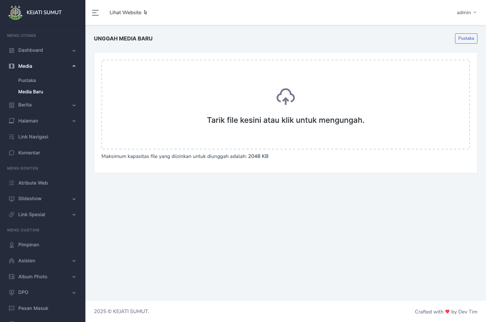
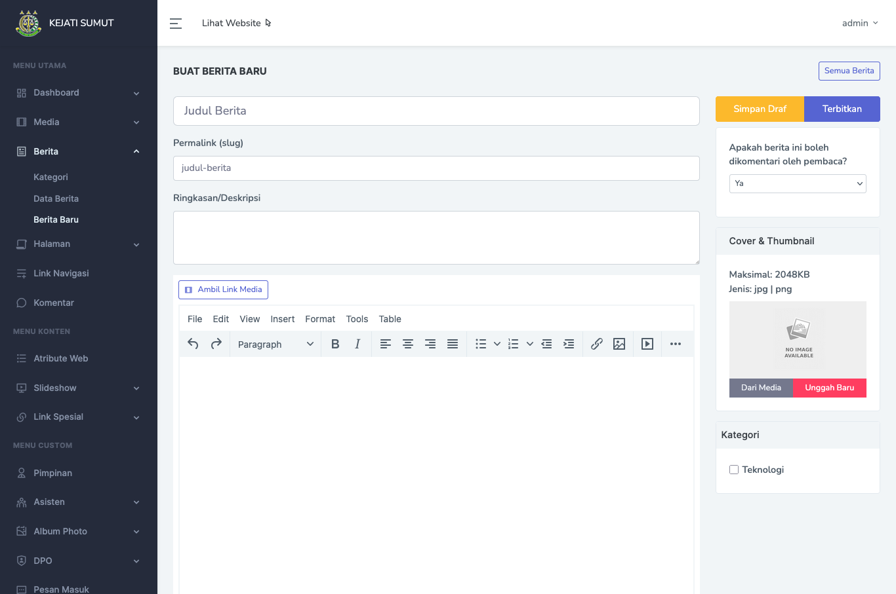
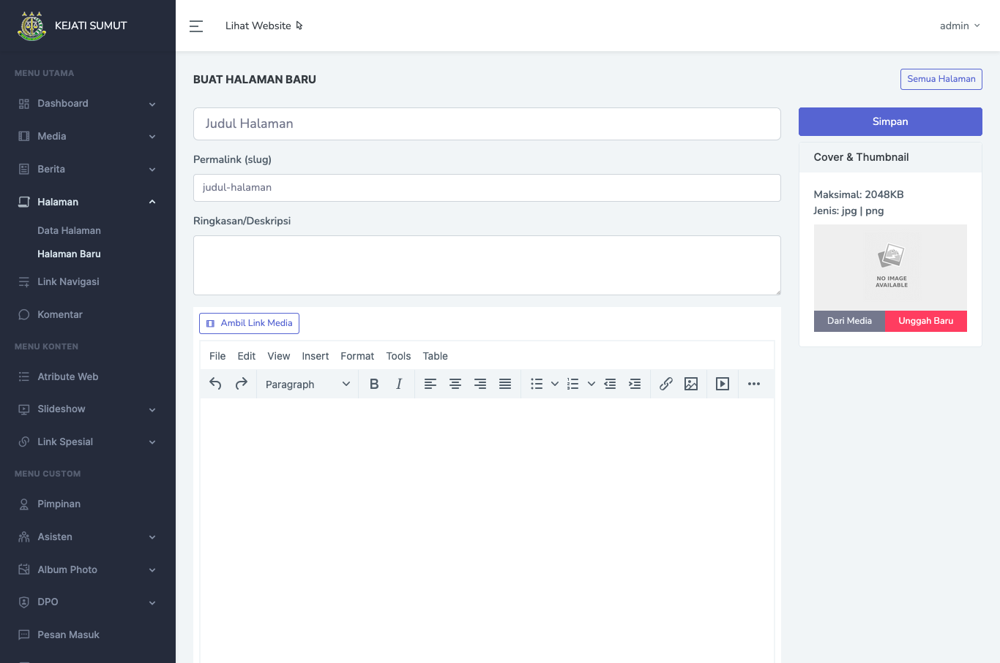
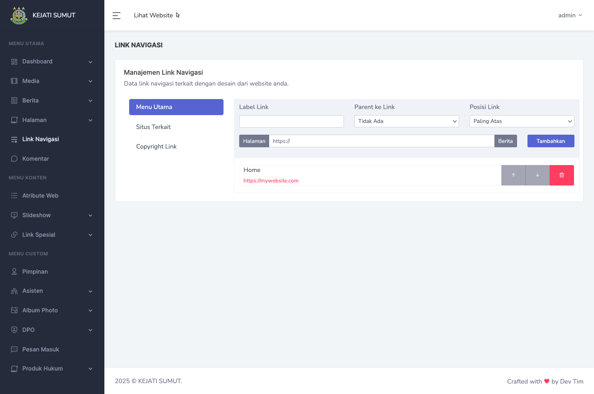

# WebCMS - Sistem Manajemen Konten Sederhana

**WebCMS** adalah aplikasi content management system (CMS) sederhana yang dikembangkan sebagai alternatif ringan dari WordPress. Sistem ini dirancang khusus untuk pengelolaan konten website pribadi atau proyek custom, dengan fleksibilitas penuh bagi developer Laravel dalam mengatur tampilan dan struktur situs sesuai kebutuhan.

## 🎯 Tujuan

WebCMS ditujukan untuk developer yang ingin membangun website dengan HTML statis, namun tetap membutuhkan dashboard backend untuk mengelola konten seperti berita, halaman, media, slideshow, komentar, dan lainnya. Cocok untuk proyek-proyek klien yang tidak membutuhkan fitur kompleks WordPress, namun tetap ingin kontrol atas isi situs.

## 🚀 Fitur Utama

- Manajemen Media dan Gambar
- Berita dan Halaman Statis
- Link Navigasi dan Link Spesial
- Komentar Pengunjung
- Slideshow Konten
- Atribut Web (Footer, Meta Info, dll)

## 🖼️ Some Screenshots





## 🛠️ Teknologi

- **Framework:** Laravel 8  
- **Frontend:** jQuery  
- **Database:** MySQL

## ⚙️ Instalasi & Setup

1. Clone repository:
   ```bash
   git clone https://github.com/aldhi88/Portfolio-WebCMS.git
   cd Portfolio-WebCMS
   ```

2. Install dependencies:
   ```bash
   composer install
   ```

3. Salin file `.env.example` menjadi `.env` dan atur konfigurasi database Anda.

4. Jalankan:
   ```bash
   php artisan key:generate
   php artisan migrate
   php artisan app:init
   ```

5. Jalankan aplikasi:
   ```bash
   php artisan serve
   ```

## 📌 Catatan

WebCMS mempermudah developer dalam membangun website custom dengan Laravel, tanpa kompleksitas CMS besar seperti WordPress. Cukup integrasikan HTML statis dan atur kontennya melalui backend ini.

---